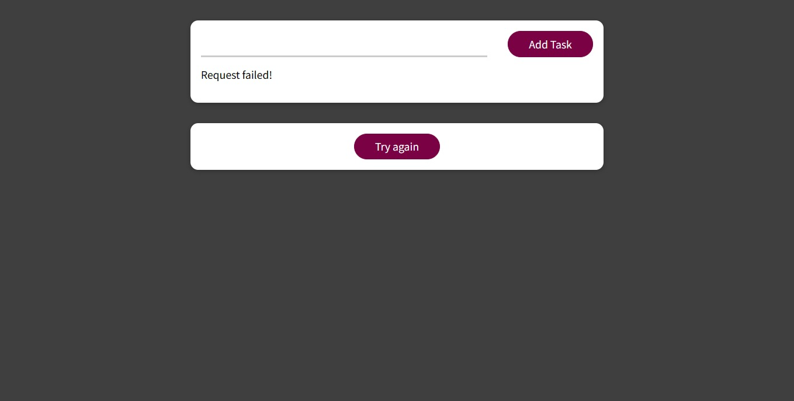

# React Tasks App

This is a simple React application for managing tasks. Users can add new tasks, view existing tasks, and mark tasks as completed.

## Table of Contents

- [React Tasks App](#react-tasks-app)
  - [Table of Contents](#table-of-contents)
  - [Features](#features)
  - [Dependencies](#dependencies)
  - [Project Structure](#project-structure)
  - [Preview](#preview)
  - [Contributing](#contributing)
  - [Contact Me](#contact-me)

## Features

- Add new tasks
- View existing tasks
- Mark tasks as completed

## Dependencies

This project uses the following dependencies:

- React: [https://reactjs.org/](https://reactjs.org/)

## Project Structure

- `src/components`: Contains React components.
- `src/hooks`: Custom hooks for handling HTTP requests.
- `src/UI`: Reusable UI components.
- `src/App.js`: Main application component.
- `src/index.js`: Entry point for the React application.

## Preview

## Contributing

Feel free to contribute to this project. If you find any issues or have suggestions for improvements, please open an issue or create a pull request.

## Contact Me

If you have any questions or suggestions, feel free to contact me:

- GitHub: [Adham Nasser](https://github.com/Adhamxiii)
- Linkedin: [Adham Nasser](https://www.linkedin.com/in/adhamnasser/)
